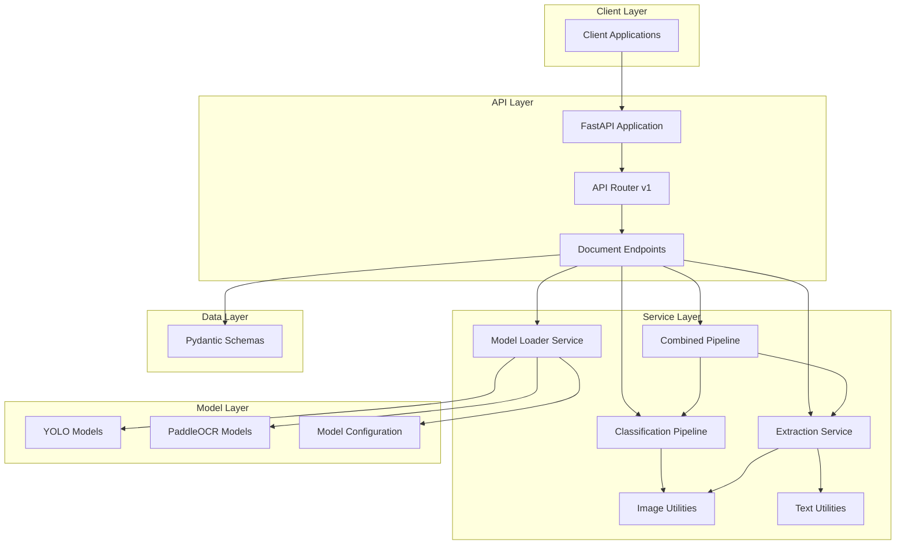
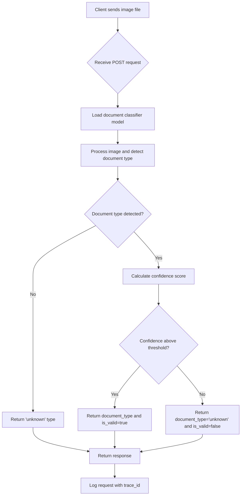
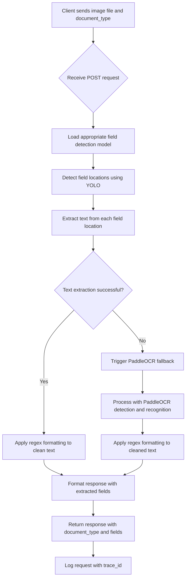
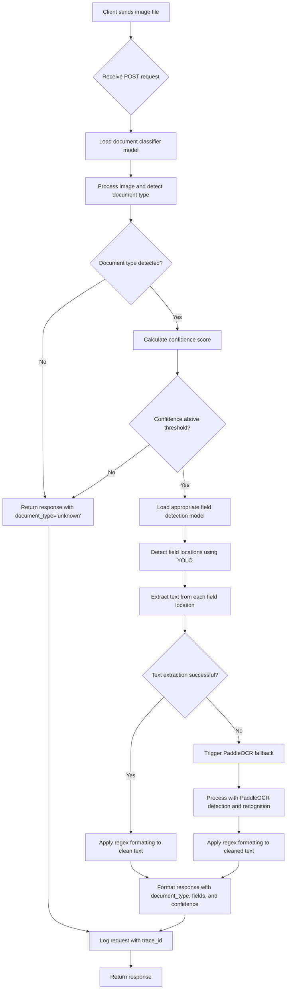

# Bharat ID Validator

## ⚠️ Personal Prototype - Not For Production Use ⚠️

**PERSONAL LEARNING PROJECT**: This project was created as a personal prototype to explore and learn about ID document validation systems. It represents one component of a larger identity verification system and is shared primarily as a demonstration of the author's learning journey. This is NOT intended for production use and may contain security vulnerabilities that could compromise systems if deployed in a live environment. The author is not responsible for any damages or security breaches resulting from the use of this software in production environments.

## Overview
The **Bharat ID Validator** is a high-performance FastAPI application designed to classify, validate, and extract data from Indian identity documents. It leverages **Ultralytics YOLO** for classification and field detection, along with **PaddleOCR** modules for document orientation correction, text recognition, and intelligent multi-line text extraction fallback.

This service provides robust document processing capabilities for various Indian identity documents including Aadhaar cards, PAN cards, Driving Licenses, Passports, and Voter IDs. The system combines machine learning models with sophisticated image processing techniques to deliver accurate and reliable document validation and data extraction.

**SECURITY WARNING**: This project contains potential security vulnerabilities including but not limited to:
- Unrestricted file upload capabilities
- Possible model exposure and adversarial attack vectors
- Resource exhaustion risks during ML processing
- Insufficient input validation for production environments

Use only in controlled personal experimentation environments.

## ⚡ Performance & Architecture Highlights

### 🚀 Optimized Performance
- **Two-phase OCR Strategy**: Fast TextRecognition (~100-300ms) for single-line fields with automatic PaddleOCR fallback for multi-line text
- **Early Validation**: Combined endpoint skips extraction when classification confidence is below threshold (~80-90% faster for invalid docs)
- **Efficient Processing**: Single image read and orientation correction for combined operations

### 🏗️ Architecture Benefits
- **Modular Design**: Clear separation of concerns with API, Core, Schemas, and Services layers
- **Singleton Pattern**: Efficient model loading with `ModelLoader` singleton pattern
- **Deduplication**: Two-stage deduplication ensures only highest confidence detection per field
- **Configurable Thresholds**: Adjustable confidence thresholds for validation logic

## 🛠️ Technology Stack

- **Core**: Python 3.10+, FastAPI, Pydantic
- **ML/AI**: Ultralytics YOLO, PaddleOCR, OpenCV
- **Utilities**: Structured logging, configuration management
- **Testing**: pytest for unit and integration tests

## 🎯 Features

- **Document Classification**: Identifies document types (Aadhaar, PAN, Driving License, Passport, Voter ID) and generalizes the output (e.g., "aadhaar" instead of "Aadhaar_Front").
- **Field Extraction**: Extracts specific fields (Name, DOB, ID numbers, addresses, etc.) from documents using YOLO detection models and OCR.
- **Two-Phase OCR Strategy**: Fast TextRecognition for single-line fields (~100-300ms) with automatic PaddleOCR fallback for multi-line text
- **Orientation Correction**: Automatically detects and corrects document rotation (0°, 90°, 180°, 270°) before processing.
- **Intelligent Processing**: Combined endpoint for classification and extraction in single pass with early validation optimization
- **Text Formatting**: Regex-based post-processing to clean and format extracted text (spacing, label removal, etc.).
- **Quality & Reliability**: Returns confidence scores and validity checks based on configurable thresholds
- **Robust Error Handling**: Semantic error codes for invalid inputs (e.g., non-image files).
- **Deduplication**: Two-stage deduplication ensures only the highest confidence detection per field is used.
- **Structured Logging**: JSON-formatted logs with unique trace IDs for debugging
- **Developer Experience**: Clean endpoints with OpenAPI documentation and dependency injection

## Project Structure
```
Bharat ID Validator/
├── app/
│   ├── api/            # API Routes and dependencies (v1)
│   ├── core/           # Configuration, Logging, Error handling, Middleware
│   ├── schemas/        # Pydantic Models for API input/output
│   └── services/       # Business Logic (ML Pipeline, Image Utils, ModelLoader)
├── docs/               # Project documentation and implementation plans
├── logs/               # Application logs (ignored by git, JSON format)
├── models/             # ML Model files (e.g., .pt) and config.json
├── tests/              # Pytest suite (Unit and Integration tests)
├── .env.example        # Example environment variables file
├── .gitignore          # Git ignore rules
├── pyproject.toml      # Project configuration (Poetry, build, static analysis)
├── requirements.txt    # Pinned Python dependencies
└── README.md           # This file
```

## 🏗️ Architecture



## Personal Learning Focus
This project represents a personal exploration and learning exercise focusing on:
- Integrating machine learning models (YOLO, OCR) into web services
- Building document processing pipelines
- Handling image processing and computer vision tasks in Python
- Creating robust APIs with FastAPI
- Implementing structured logging and error handling
- Working with Indian identity document formats

**Note**: This is a personal prototype demonstrating one component of a larger identity verification system. It is not a complete KYC or identity verification solution, but rather a learning artifact showing how this particular aspect of such a system might work.

## 🚀 Quick Start

### 1. Clone & Setup

```bash
git clone https://github.com/Aayushyaash/Bharat-ID-Validator.git
cd Bharat-ID-Validator

# Create virtual environment
python -m venv venv
venv\Scripts\activate  # Windows
# source venv/bin/activate  # Linux/Mac

# Install dependencies
pip install -r requirements.txt
```

### 2. Model Setup

*   **Download Pre-trained Models**: Use the provided script to download the required YOLO models from the original repository:
    ```bash
    python download_models.py
    ```
    This will download the following models to your `models/` directory:
    *   `Id_Classifier.pt` - Document type classification
    *   `Aadhaar_Card.pt`, `Pan_Card.pt`, `Passport.pt`, `Voter_Id.pt`, `Driving_License.pt` - Field detection models

*   **Manual Setup Alternative**: Alternatively, you can manually place your trained YOLO models in the `models/` directory:
    *   `Id_Classifier.pt` - Document type classification
    *   `Aadhaar_Card.pt`, `Pan_Card.pt`, `Passport.pt`, `Voter_Id.pt`, `Driving_License.pt` - Field detection models

*   Update `models/config.json` with the correct class mappings and field configurations.
*   *Note: PaddleOCR models (PP-LCNet_x1_0_doc_ori, PP-OCRv5_server_det, PP-OCRv5_server_rec) will download automatically on first run (~100-200MB total).*

### 🏷️ Original Model Attribution

**Model Repository**: [https://huggingface.co/logasanjeev/indian-id-validator](https://huggingface.co/logasanjeev/indian-id-validator) </br>
**Author**: LOGASANJEEV </br>
**License**: MIT License

The original models include:
- Id_Classifier (YOLO11l-cls): Classifies the type of Indian ID document
- Aadhaar (YOLO11l): Detects fields on Aadhaar cards
- Driving_License (YOLO11l): Detects fields on Driving Licenses
- Pan_Card (YOLO11l): Detects fields on PAN Cards
- Passport (YOLO11l): Detects fields on Passports
- Voter_Id (YOLO11l): Detects fields on Voter ID cards

### 3. Configuration

*   Create a `.env` file in the root directory by copying `.env.example`:
    ```bash
    cp .env.example .env
    ```
*   Edit `.env` to customize settings if needed.

### 4. Run the Service

```bash
uvicorn app.main:app --reload
```

## Usage

### Running the Server
```bash
uvicorn app.main:app --reload
```
The server will start at `http://127.0.0.1:8000`. Access logs for `/metrics` and root (`/`) are filtered out from `app.log`.

### API Documentation
Access the interactive Swagger UI at:
*   `http://127.0.0.1:8000/docs`

## 🖥️ Access Points

| Service | URL |
|---------|-----|
| **API Server** | http://127.0.0.1:8000 |
| **API Docs** | http://127.0.0.1:8000/docs |
| **Health Check** | http://127.0.0.1:8000/metrics |

### Example Request
**Endpoint:** `POST /api/v1/documents/classify`

**Request Headers:**
*   You can optionally add `X-Trace-ID` with a unique ID to correlate your requests with logs.

**Body (form-data):**
*   `file`: (Select an image file, e.g., `aadhaar_front.jpg`)

**Response (Example for `aadhaar_front.jpg`):**
```json
{
  "filename": "aadhaar_front.jpg",
  "document_type": "aadhaar",
  "confidence": 0.995,
  "is_valid": true
}
```
If confidence is below the threshold or models fail, `document_type` will be "unknown" and `is_valid` will be `false`.

## Configuration
The application can be configured using environment variables set directly or via a `.env` file (preferred for local development).

| Setting | Type | Default | Description |
| :-------------------- | :--- | :------ | :--------------------------------------------------------------------------------------------------------------------- |
| `PROJECT_NAME` | `str` | `"Bharat ID Validator"` | The name of the FastAPI project. |
| `API_V1_STR` | `str` | `"/api/v1"` | The prefix for API version 1 routes. |
| `CONFIDENCE_THRESHOLD` | `float` | `0.98` | Minimum confidence score (0.0 to 1.0) for a document to be considered valid and classified to a specific type. |
| `LOG_EXCLUDED_PATHS` | `set[str]` | `{"/metrics", "/", "/health", "/ready"}` | Paths whose access logs will be filtered out to reduce log noise. |

## PaddleOCR Fallback Mechanism

The extraction endpoint utilizes an intelligent **two-phase OCR strategy** to handle both simple and complex text extraction scenarios:

### Phase 1: Fast TextRecognition (Primary)
- **Speed**: ~100-300ms per field
- **Use Case**: Single-line fields (Name, DOB, ID numbers, Gender, etc.)
- **Model**: PaddleOCR's `TextRecognition` module with `PP-OCRv5_server_rec`

### Phase 2: PaddleOCR Fallback (Automatic)
When Phase 1 returns empty results (common with multi-line text), the system automatically:

1. **Extends the cropped image** by adding white padding (1px height, 20px width on each side)
2. **Runs full PaddleOCR pipeline** with:
   - Text Detection (`PP-OCRv5_server_det`)
   - Text Recognition (`PP-OCRv5_server_rec`)
   - Document unwarping enabled
3. **Applies regex-based formatting**:
   - Removes label prefixes ("Address:", "Name:")
   - Adds proper spacing between digits and letters
   - Cleans up commas and punctuation
4. **Logs the fallback trigger** for monitoring and debugging

**Performance**: Fallback adds ~1-3 seconds per field but significantly improves accuracy for:
- Multi-line addresses (Aadhaar back, Voter ID)
- Complex text layouts
- Text near image edges

**Monitoring**: Check logs for `"triggering PaddleOCR fallback"` messages to track fallback usage frequency.

## 🧪 Testing & Verification

Run the comprehensive test suite (unit and integration tests) to verify your installation:

```bash
pytest
```

## System Requirements
*   **CPU**: Multi-core processor recommended for ML inference
*   **RAM**: Minimum 4GB (8GB+ recommended for optimal performance)
*   **Storage**: Sufficient space for models (typically 50MB-1GB depending on model size and PaddleOCR caches)
*   **Operating System**: Linux, macOS, or Windows (tested on Windows)

## API Endpoints

### Health & Status
*   `GET /` - Basic service status check.
*   `GET /metrics` - Health check endpoint, returns `{"status": "ok", "message": "endpoint is healthy"}`. Logs are filtered.

### Document Processing

#### 1. Classification Endpoint
**`POST /api/v1/documents/classify`**

Classifies an uploaded document image and returns the document type with confidence score.

**Request:**
*   Method: `POST`
*   Content-Type: `multipart/form-data`
*   Body: `file` - Image file (JPG, PNG, etc.)

**Response:**
```json
{
  "filename": "aadhaar_front.jpg",
  "document_type": "aadhaar",
  "confidence": 0.995,
  "is_valid": true
}
```

**Supported Document Types:**
*   Aadhaar Card (Front/Back)
*   PAN Card
*   Driving License (Front/Back)
*   Passport
*   Voter ID

#### Classification Flow Chart


#### 2. Extraction Endpoint
**`POST /api/v1/documents/extract`**

Extracts specific field data from a document based on its type.

**Request:**
*   Method: `POST`
*   Content-Type: `multipart/form-data`
*   Body:
    *   `file` - Image file
    *   `document_type` - Type of document (e.g., `"aadhaar_front"`, `"pan_card"`, `"voter_id"`)

**Response Example (Aadhaar Front):**
```json
{
  "document_type": "aadhaar_front",
  "fields": {
    "Name": "John Doe",
    "Aadhaar": "1234 5678 9012",
    "Gender": "Male",
    "DOB": "01/01/1990"
  }
}
```

**Response Example (Aadhaar Back with Multi-line Address):**
```json
{
  "document_type": "aadhaar_back",
  "fields": {
    "Aadhaar": "1234 5678 9012",
    "Address": "A/24, Link Road, New Delhi 110001"
  }
}
```

**Extraction Features:**
*   Automatic field detection using YOLO models
*   Fast text recognition for single-line fields
*   **PaddleOCR Fallback**: Automatically triggered for multi-line text when primary OCR returns empty
*   Regex-based text formatting and cleaning
*   Returns `"N/A"` for fields not found in the document

**Supported Extraction Types:**
*   `aadhaar_front` - Name, Aadhaar Number, Gender, DOB
*   `aadhaar_back` - Aadhaar Number, Address (multi-line)
*   `pan_card` - PAN, Name, Father's Name, DOB
*   `passport` - Name, Code, DOB, Gender, Nationality, Address, etc.
*   `voter_id` - Name, Voter ID, Gender, DOB, Address, Father, etc.
*   `driving_license` - Name, DL No, DOB, Address, Blood Group, etc.

#### Extraction Flow Chart


#### 3. Combined Endpoint
**`POST /api/v1/documents/classify-and-extract`**

Unified endpoint that performs both classification and field extraction in a single request.

**Request:**
*   Method: `POST`
*   Content-Type: `multipart/form-data`
*   Body: `file` - Image file

**Response Example (Success):**
```json
{
  "filename": "aadhaar.jpg",
  "document_type": "aadhaar",
  "confidence": 0.995,
  "is_valid": true,
  "fields": {
    "Name": "John Doe",
    "Aadhaar": "1234 5678 9012",
    "Gender": "Male",
    "DOB": "01/01/1990"
  },
  "extraction_message": null
}
```

**Response Example (Low Confidence / Early Return):**
```json
{
  "filename": "blurry.jpg",
  "document_type": "unknown",
  "confidence": 0.42,
  "is_valid": false,
  "fields": null,
  "extraction_message": "Classification confidence below threshold - extraction skipped"
}
```

**Key Features:**
*   **Efficiency**: Reads image and corrects orientation only once.
*   **Early Validation**: If classification confidence is below threshold, extraction is skipped entirely (~80-90% faster for invalid docs).
*   **Simplicity**: Reduces client-side logic by combining two steps.

#### Combined Flow Chart


## Development Guidelines

### Architecture
The application follows a modular, layered architecture with a clear separation of concerns, adhering to FastAPI best practices.

### Dependency Management
*   Uses `requirements.txt` with pinned versions for reproducible environments.
*   `pyproject.toml` defines project metadata and tool configurations.

### Observability
*   **Structured Logging:** File logs are in JSON for easy parsing by log aggregators.
*   **Trace IDs:** `X-Trace-ID` header is used for request correlation across logs.

### Security
*   **CORS:** Currently configured `allow_origins=["*"]` for development convenience. **MUST BE RESTRICTED** to specific frontend domains in production.

## 🔮 Future Upgrades

This section documents planned improvements and known issues that are deferred for future implementation.

### 🔴 High Priority

#### Security
| Item | Description |
|------|-------------|
| **CORS Hardening** | Replace wildcard `allow_origins=["*"]` with specific allowed domains to prevent CSRF attacks and credential leakage in production deployments. |
| **Rate Limiting** | Add rate limiting middleware to protect against DoS attacks and API abuse. ML inference is computationally expensive and needs protection. |

#### Data Quality
| Item | Description |
|------|-------------|
| **Voter_Id Output Mapping** | Fix incorrect field mappings in `models/config.json` for Voter_Id document type. Current mappings appear to have copy-paste errors (e.g., "name" mapped to "Portrait"). |

### 🟡 Medium Priority

#### Performance
| Item | Description |
|------|-------------|
| **Batch Processing Support** | Add endpoints for processing multiple documents in a single request with streaming responses for large batches. |
| **Async ML Inference** | Evaluate using `run_in_executor` patterns for CPU-bound ML operations to improve concurrent request handling. |

#### Code Quality
| Item | Description |
|------|-------------|
| **OpenCV Dependency Consolidation** | Remove duplicate OpenCV packages from `requirements.txt`. Currently installs `opencv-contrib-python`, `opencv-python`, and `opencv-python-headless` - only one should be used. |
| **Environment-Specific Configs** | Add separate configuration profiles for development, staging, and production environments with appropriate defaults for each. |

### 🟢 Considerations for Future

#### CI/CD Pipeline
| Item | Description |
|------|-------------|
| **GitHub Actions Workflow** | Implement CI/CD pipeline for automated linting (ruff/flake8), formatting checks (black), type checking (mypy), and test execution on pull requests. |
| **Pre-commit Hooks** | Add pre-commit configuration for local development to catch issues before commits. |

#### Observability
| Item | Description |
|------|-------------|
| **Full Prometheus Integration** | Extend `/metrics` endpoint with actual Prometheus metrics including request latency histograms, model inference times, and error rates. |
| **Distributed Tracing** | Add OpenTelemetry integration for distributed tracing across service boundaries. |


## 📄 License

MIT License. See [LICENSE](LICENSE) for details.
