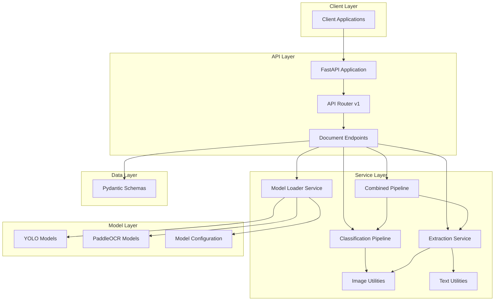

# Architecture Documentation

## ID Validator Service Architecture

### Overview
The ID Validator Service is a machine learning-powered document processing system built with FastAPI. It combines computer vision (YOLO) and optical character recognition (PaddleOCR) technologies to classify and extract data from identity documents. The architecture follows a layered approach with clear separation of concerns between API, business logic, and model inference layers.

### System Architecture

### Architecture Layers

#### 1. API Layer (`app/api/`)
- **Purpose**: Handles HTTP requests and responses
- **Components**: 
  - FastAPI application entry point (`app/main.py`)
  - API router (`app/api/v1/api.py`)
  - Document endpoints (`app/api/v1/endpoints/documents.py`)
- **Responsibilities**:
  - Request validation and routing
  - Response serialization
  - Error handling
  - CORS and middleware management

#### 2. Core Layer (`app/core/`)
- **Purpose**: Contains application-wide configuration and utilities
- **Components**:
  - Configuration (`app/core/config.py`)
  - Logging (`app/core/logging.py`)
  - Error handling (`app/core/errors.py`)
  - Middleware (`app/core/middleware.py`)
- **Responsibilities**:
  - Application settings management
  - Structured logging with trace IDs
  - Cross-cutting concerns
  - Error response formatting

#### 3. Schema Layer (`app/schemas/`)
- **Purpose**: Defines data structures for API contracts
- **Components**:
  - Document response models (`app/schemas/document.py`)
- **Responsibilities**:
  - Request/response validation
  - Type safety
  - API contract definition

#### 4. Service Layer (`app/services/`)
- **Purpose**: Implements business logic and orchestrates document processing
- **Components**:
  - Model loader (`app/services/model_loader.py`)
  - Classification pipeline (`app/services/pipeline.py`)
  - Extraction service (`app/services/extraction.py`)
  - Combined pipeline (`app/services/combined_pipeline.py`)
  - Image utilities (`app/services/image_utils.py`)
  - Text utilities (`app/services/text_utils.py`)
- **Responsibilities**:
  - Document classification and extraction logic
  - Model management and orchestration
  - Image preprocessing and postprocessing
  - OCR processing and text formatting

#### 5. Model Layer (`models/`)
- **Purpose**: Contains ML models and configuration
- **Components**:
  - YOLO model files (`.pt` files)
  - Model configuration (`models/config.json`)
- **Responsibilities**:
  - Document classification models
  - Field detection models
  - Model configuration and mappings

### Key Design Decisions

#### 1. Singleton Model Loader Pattern
- **Problem**: ML models consume significant memory and should be loaded once
- **Solution**: Implemented `ModelLoader` as a singleton class that loads all models at application startup
- **Benefits**:
  - Memory efficiency
  - Faster inference times
  - Centralized model management
- **Note**: If core models fail to load, the application will raise an exception and fail to start

#### 2. Two-Phase OCR Strategy
- **Problem**: Different text patterns require different OCR approaches
- **Solution**: Implemented dual OCR strategy:
  - Phase 1: Fast TextRecognition for single-line fields
  - Phase 2: Full PaddleOCR fallback for multi-line text
- **Benefits**:
  - Optimized performance for different text types
  - Better accuracy for complex layouts
  - Reduced processing time for simple fields

#### 3. Document Orientation Correction
- **Problem**: Documents may be uploaded in various orientations
- **Solution**: Integrated PaddleOCR's document orientation detection to automatically correct rotation
- **Benefits**:
  - Improved OCR accuracy
  - Better user experience
  - Robust processing regardless of upload orientation

#### 4. Deduplication Algorithm
- **Problem**: Multiple detections for the same field can occur
- **Solution**: Implemented two-stage deduplication:
  - Stage 1: Keep highest confidence per raw class name
  - Stage 2: Keep highest confidence per display name
- **Benefits**:
  - Cleaner output
  - More reliable field extraction
  - Reduced duplicate data

#### 5. Asynchronous I/O with Synchronous Processing
- **Problem**: Need to handle I/O efficiently while performing CPU-intensive ML operations
- **Solution**: 
  - Asynchronous file uploads and I/O operations
  - Synchronous ML processing using `run_in_threadpool`
- **Benefits**:
  - Efficient resource utilization
  - Better concurrency handling
  - Maintained performance for CPU-bound tasks

### Component Interactions

#### Document Classification Flow
1. Client uploads image to `/api/v1/documents/classify`
2. API endpoint validates request and reads image asynchronously
3. Image is passed to `pipeline.classify_document_sync()` via thread pool
4. Pipeline detects orientation and runs YOLO classification
5. Result is validated against confidence threshold
6. Response is formatted and returned to client

#### Document Extraction Flow
1. Client uploads image to `/api/v1/documents/extract`
2. API endpoint validates request and reads image asynchronously
3. Image and document type are passed to `extraction.extract_data()` via thread pool
4. Extraction service validates document type and retrieves appropriate model
5. YOLO detection identifies field locations
6. OCR processes each detected field with two-phase strategy
7. Results are formatted according to document schema
8. Response is returned to client

#### Combined Classification and Extraction Flow
1. Client uploads image to `/api/v1/documents/classify-and-extract`
2. API endpoint validates request and reads image asynchronously
3. Image is passed to `combined_pipeline.process_document_sync()` via thread pool
4. Pipeline performs classification and validates confidence
5. If confidence is sufficient, extraction proceeds with same corrected image
6. Both classification and extraction results are combined
7. Response is returned to client

### Performance Considerations

#### Model Loading
- Models are loaded once at startup to avoid repeated loading overhead
- Singleton pattern ensures efficient memory usage
- Lazy loading could be implemented for rarely-used models

#### Image Processing
- Orientation correction applied once per document
- Image rotation performed using optimized OpenCV operations
- Memory-efficient image handling with NumPy arrays

#### OCR Optimization
- Fast TextRecognition used for simple fields
- PaddleOCR fallback only when needed
- Image padding added for improved OCR accuracy on edge text

### Scalability Patterns

#### Horizontal Scaling
- Stateless design allows for horizontal scaling
- Models loaded per instance
- Shared storage for model files possible in containerized deployments

#### Resource Management
- Thread pools manage CPU-intensive operations
- Memory usage optimized through singleton model loader
- Logging optimized to reduce I/O overhead

### Error Handling Strategy

#### Client Errors
- Invalid file types return 400 Bad Request
- Unsupported document types return 400 Bad Request
- Validation failures return appropriate error codes

#### Server Errors
- Model loading failures cause startup failure
- Processing errors return 500 Internal Server Error
- Graceful degradation when possible

#### Recovery Patterns
- Health checks monitor service status
- Structured logging enables debugging
- Confidence thresholds prevent low-quality results

### Security Considerations

#### Input Validation
- File type validation prevents malicious uploads
- Size limits prevent resource exhaustion
- Content validation ensures image files

#### API Security
- CORS configured for development (should be restricted in production)
- Rate limiting could be implemented for production
- Authentication could be added for sensitive operations

### Deployment Architecture

#### Production Considerations
- Containerization with Docker for consistent deployment
- Environment-specific configuration
- Health checks for orchestration platforms
- Monitoring and alerting integration

#### Infrastructure Requirements
- GPU acceleration for optimal performance (optional)
- Sufficient RAM for model loading
- Persistent storage for logs
- Network access for model downloads (first run)