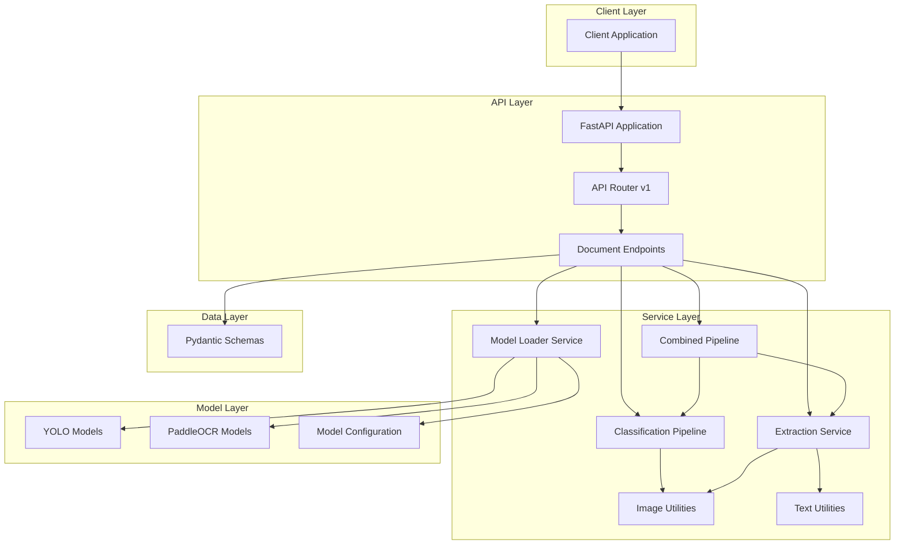
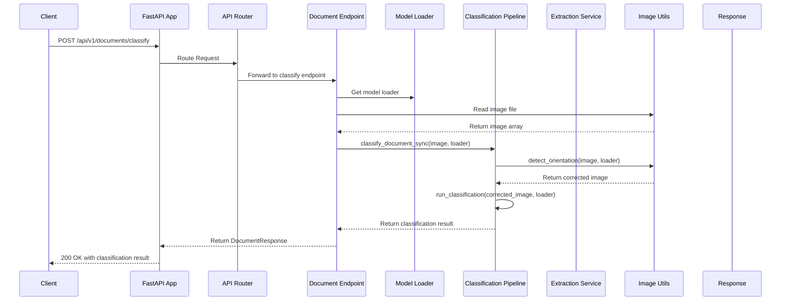
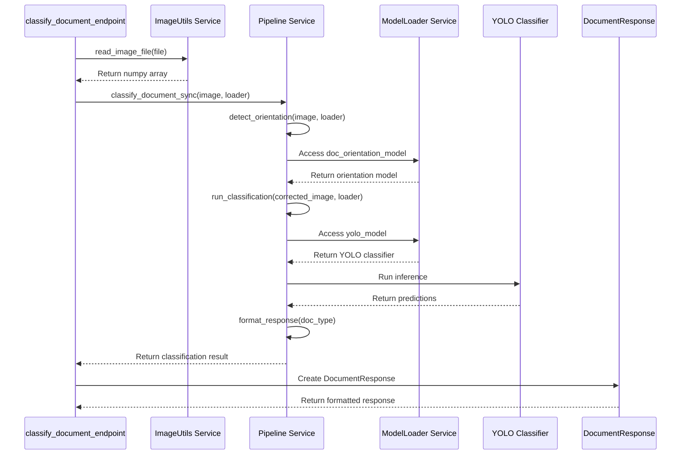
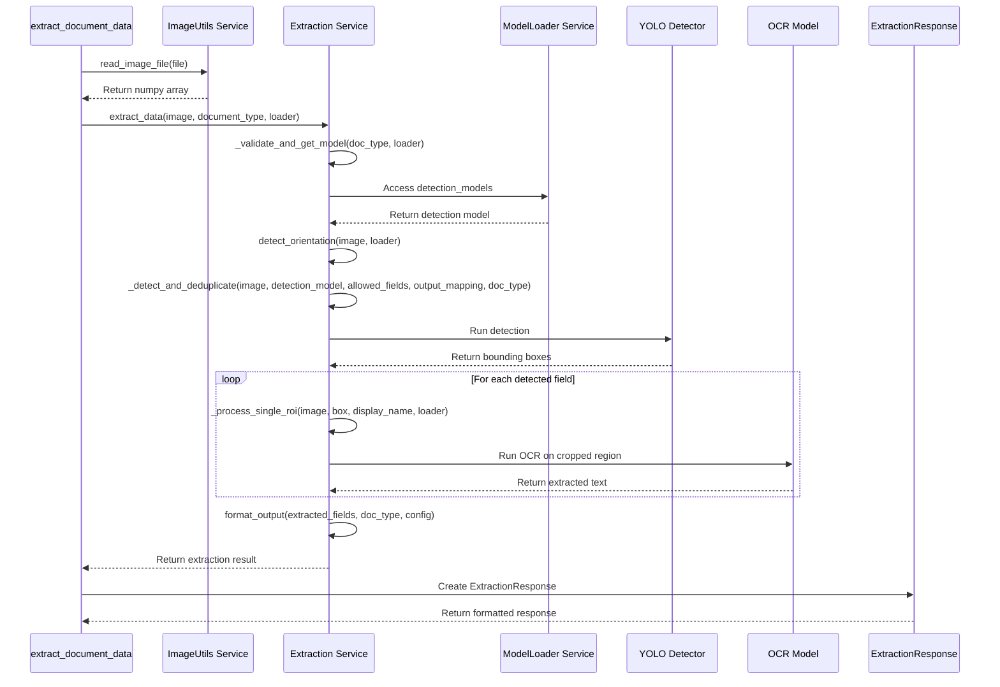
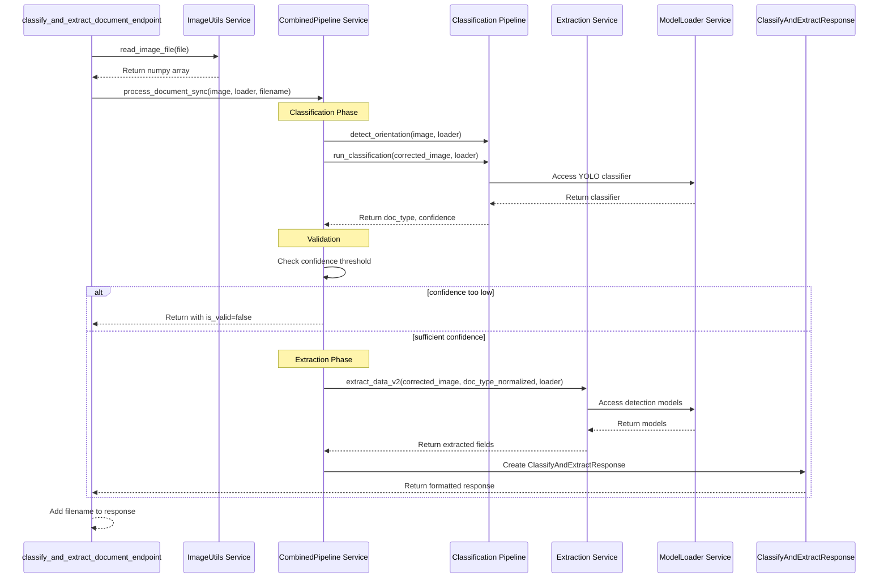
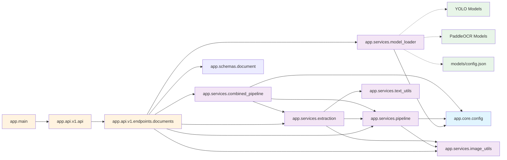
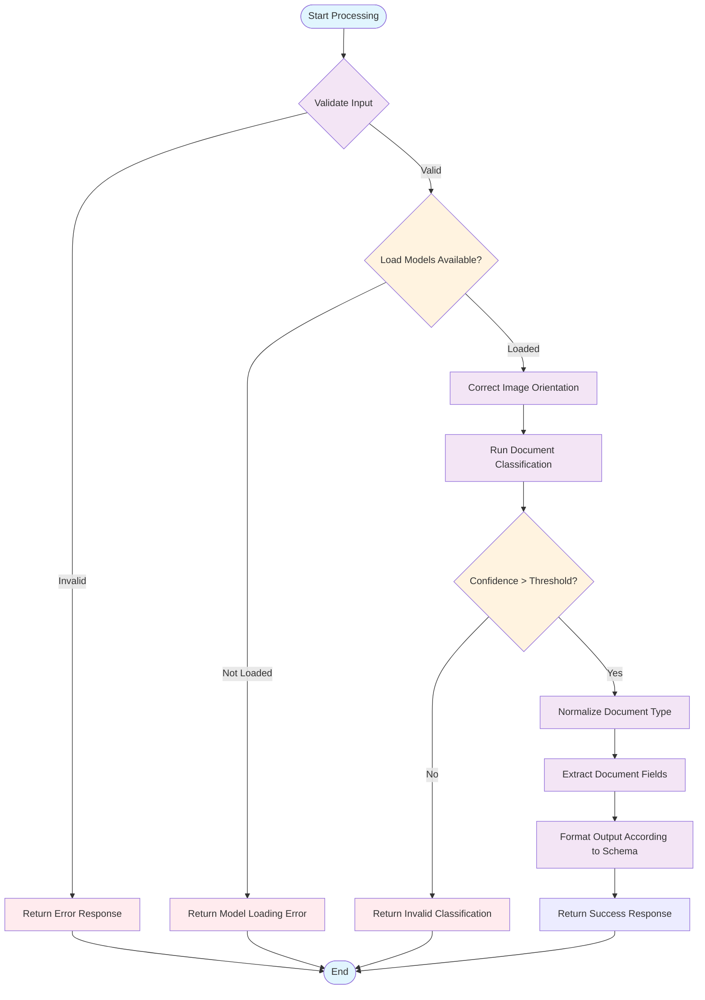

# ID Validator Service - Architecture Diagrams

## 1. System Architecture Component Diagram

This diagram shows the high-level architecture of the ID Validator Service, including the main layers and their relationships.

## 2. API Request Flow Sequence Diagram

This sequence diagram shows the flow of requests through the API endpoints, from client to response.

## 3. Document Classification Flow Sequence Diagram

This sequence diagram shows the detailed flow for document classification.

## 4. Document Extraction Flow Sequence Diagram

This sequence diagram shows the detailed flow for document field extraction.

## 5. Combined Classification and Extraction Flow

This sequence diagram shows the flow for the combined endpoint that performs both classification and extraction.

## 6. Module Dependency Diagram

This diagram shows the dependencies between different modules in the application.

## 7. Service Interaction Flowchart

This flowchart shows the logical flow and decision points in the document processing services.

## 8. Data Flow Architecture

This diagram shows how data flows through the system from input to output.

```mermaid
graph LR
    subgraph "Input"
        ImageFile["Image File Upload"]
    end
    
    subgraph "Preprocessing"
        ImageRead["Read Image to Array"]
        OrientationDetect["Detect & Correct Orientation"]
    end
    
    subgraph "Processing"
        Classification["Document Classification"]
        FieldDetection["Field Detection"]
        OCRProcessing["OCR Processing"]
    end
    
    subgraph "Post-processing"
        FormatOutput["Format Output"]
        Validation["Validate Results"]
    end
    
    subgraph "Output"
        Response["Structured Response"]
    end
    
    ImageFile --> ImageRead
    ImageRead --> OrientationDetect
    OrientationDetect --> Classification
    OrientationDetect --> FieldDetection
    Classification --> FieldDetection
    FieldDetection --> OCRProcessing
    OCRProcessing --> FormatOutput
    FormatOutput --> Validation
    Validation --> Response
```

